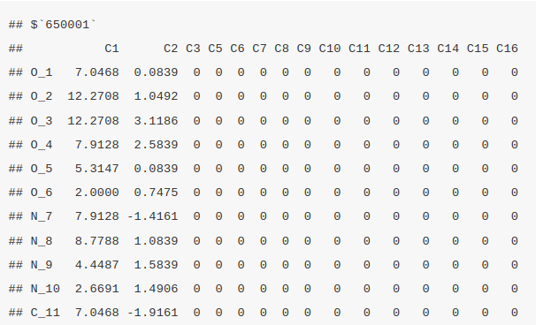
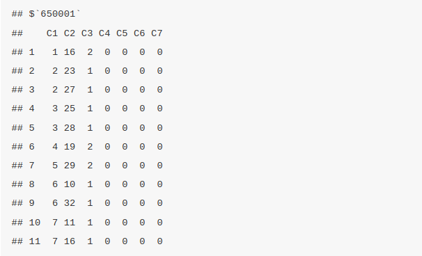
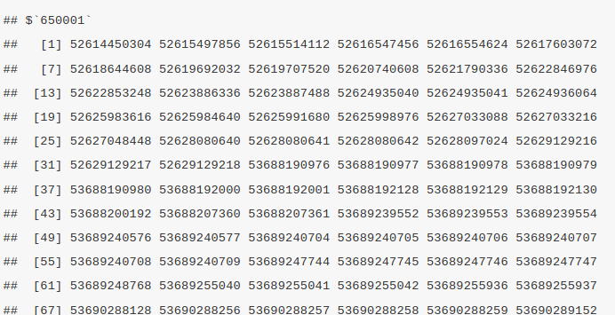

# Chemical Properties prediction and visualized. 
<span style="color: green;">Structural properties similarity searching</span>  
<span style="color: green;">Molecular visualizations</span>

## Whats is ChemmineR?
ChemmineR is an R package under the BioConductor library that is designed for the analysis and visualization of chemical data, especially on molecules and compounds. Below are some of its key features; 

1. **Visualization**: It provide tools that visualize the chemical structures and theor relationships. This make it easier to interpret and communicate your findings. 
2. **Chemical Structure Handling**: ChemmineR can read, write, and manipulate chemical structures. These structures are stored in file formats like SDF and SMILES which are the industry standard ways to describe the molecular structure in text format. 
3. **Clustering**: ChemmineR can identify patterns and relationships between different molecules by grouping the like ones together.
4. **Structure Similarity Search**: ChemmineR can compare different chemical structures and find their similarity and how useful they are for certain tasks like identifying compounds that may have similar properties or biological effects. 

## Installation 
The `ChemmineR` package can be installed from R with: 

```
if(!requireNamespace("BioManager", quitely=TRUE))
install.packages("BioManager")
BiocManager::install("ChemminerR")
```

## Loading the package and Documentation 
The below command is called to invoke the `ChemmineR` package to the program 
```{r error=FALSE, warning=FALSE, message=FALSE}
library("ChemmineR") # Loads the package
```

To find the documentation and list all functions and classes call the command below
```
library(help="ChemmineR") # Lists all the functions and classes
```

To open a PDF manual for `ChemmineR` documentation from R
```
vignette("ChemmineR")
```

## Create Instances of SDFset class
SDF(Structure-Data-File) is the standard format for representing the chemical structures. Let me briefly walk you through a practical session on how to work with SDF files before diving deep into ChemmineR package. 

- **Load the `sdfsample` file**  
This is a built in dataset in ChemmineR. It is loaded by

```{r}
data("sdfsample")
```

- **Explore the `SDFset` object**  
This data type falls under the class `SDFset`.
```{r}
class(sdfsample)
```

Calling the data set by its name provides the summary
```{r}
sdfsample
```
In this case, the sdfsample has 100 molecules. To access a specific molecule, call it by index. For instance,accessing the first molecule;

```{r}
view(sdfsample[1])
```
-**Get the names of the molecules**  
To find column names of the sdf data set call the `sdfid` command. 
```{r}
sdfid(sdfsample)
```

The SDF dataset can alsio be converted to SMILES (Simplified Molecular Input Line Entry System) format. However, you need to install the ChemmineOB before converting SMILE format
```
BiocManager::install("ChemmineOB")
```
the convert the file 

```{r}
smiles <- sdf2smiles(sdfsample)
head(smiles)
```

- **Save and export the SDF data**  
The SDF file can be exported to a file locally.
```{r}
write.SDF(sdfsample, file="data/sdfsample_export.sdf")
```

## Retrieving atom, bond and data block
**Atom block**  
The atom block provides information about each atom in a molecule, including its coordinates in 3D space and the element symbol. It can be retrieved using ChemmineR by invoking the function `atomblock`. In this case, we are retrieving the atom block information of the first four molecules.

```
atomblock(sdfset[1:4])
```
<br>


**Bond block**  
The bond block provide the details of the connection between/among atoms and the type of bond. The bond block information can be retrieved by the function `bondblock`. In this case we are retrieving the bonblock information of the first four molecules

```
bondblock(sdfset[1:4])
```
<br>


**Data Block**  
This function contains the additional information or the metadata found on the SDF file. This metadata is the information connected to the molecular properties for instance the molecular weight and logP. 
```{r}
datablock(sdfset[1:4])
```

### Assigning compound IDS and keeping them unique

Return IDs from SDFset object. They are the compound IDS stored in the data block of each molecule within the SDFset that are used to unique identify each molecule. In this case we will subset and return the first four molecules. 
```{r}
cid(sdfset)[1:4]
```

Returns IDs from SD file header. The data set might have been combined from other different smaller data sets therefore, the `makeUnique()` function is used a unique ID to each molecule. It does by appending the suffixes "_1", "_2" to the compound IDS. This is also used to handle the duplicates. 
```{r}
unique_ids <- makeUnique(sdfid(sdfset))
cid(sdfset) <- unique_ids
```


### Converting the data blocks in an SDFset to a matrix
These data blocks can also be converted to a matrix by 

```{r}
blockmatrix <- datablock2ma(datablocklist = datablock(sdfset))
```

The matrix can also be split into numeric and character matrix by `splitNumChar()` function
```{r}
numchar <- splitNumChar(blockmatrix = blockmatrix)
```

Slice the numeric matrix 

```{r}
numchar[[1]][1:2,1:2]
```

Slice the character matrix 
```
numchar[[2]][1:2, 10:11]
```

Compute atom frequency matrix, molecular weight and formula 
The molecular formula for each molecule can be computed by  the `MF()` function and will return an output that is a character of vectors, each entry corresponding to a molecule in the SDFset. `MW` calculates the molecular weight similar to the `MF` function where each molecule corresponds to the molecule in the SDFset. 
```{r}
propma <- data.frame(MF=MF(sdfset),
                     MW=MW(sdfset), atomcountMA(sdfset))

propma[1:4,]
```

Assign matrix data to data block 
```{r}
datablock(sdfset) <- propma
datablock(sdfset[1]) # call the first compound in the databases 
```

### String searching in SDFset

Returns the  summary view of the matches 
```{r}
grepSDFset("650001", 
           sdfset,
           field="datablock",
           mode="subset")
```
The molecules can searched using the `grepSDSFset` function. The searching is performed by string marching and then returns an SDF summary of the matching entries. In this case we will search the molecule by index. 
```{r}
grepSDFset("650001", 
           sdfset,
           field="datablock",
           mode="index")
```

## Molecular visualization in R 

Export SDFset to SDF file locally

```{r}
write.SDF(sdfset[1:4], file="data/sub.sdf", sig=TRUE)
```

Plot molecule structure of one or many SDFs

```{r}
plot(sdfset[1:4], print=FALSE) # plots structures to R graphics device
```

Compound viewing in web browser
```
sdf.visualize(sdfset[1:4])
```

You save the image of the visualization
```{r}
save.image("nstc.Rdata")
```

### Molecular Property Functions
Different types of atoms vary in their frequency across all molecules in an SDFset. The `atomCountMA()` is used to compute their frequency. 

```{r}
propma <- atomcountMA(sdfset, addH=FALSE) 
boxplot(propma, col="blue", main="Atom Frequency")
```

In the above SDFset, Carbon and Hydrogen atoms are the most frequent while Flourine and Chlorine atoms are the least frequent in this sample SDFset. 
These data is stored in the variable `atomprop`. 

### Similarity Comparisons and Searching
#### Maximum Common Substructure(MCS) Searching
ChemmineR provides a functionality/algorithm that can be used to perform a pairwise compound comparison, clustering and similarity searching. This package is just but an add-on package to ChemmineR referred to as `fmcsR` and can be installed by 
```
BiocManager::install("fmcsR")
```

To load the library to the console run 
```{r}
library(fmcsR)
```

We will use a different SDSFset provided by the `fmcsR` package and compare between caffeine and viagra

```{r}
 data(fmcstest) # Loads test sdfset object 
 test <- fmcs(fmcstest[1], fmcstest[2], au=2, bu=1) # Searches for MCS with mismatches 
 plotMCS(test) # Plots both query compounds with MCS in color 
```

#### AP/APset Classes for Storing Atom Pair Descriptors
Atom pair descriptors are a type of molecular fingerprint that capture information about the types of atoms and the distances between them in a molecule, which is useful for comparing and analyzing molecular structures. 

`ChemmineR` and `fmcsR` libraries has got you covered on this, the function `sdf2ap()` function is used to convert an SDF data of a molecule into atom pair descriptors. Lets extract the atom pair descriptors of the first molecule. 

```{r}
 ap <- sdf2ap(sdfset[[1]]) # For single compound
 ap
```

```
# Extract for many compounds 
 apset <- sdf2ap(sdfset)

cid(apset[1:4]) # Compound IDs 
ap(apset[1:4]) # Atom pair descriptors 
db.explain(apset[1]) # Return atom pairs in human readable format 
```



## Resources
The complete documentation (with code) of the `ChemmineR` package can be found below here 
- https://www.bioconductor.org/packages/release/bioc/vignettes/ChemmineR/inst/doc/ChemmineR.html
- https://www.bioconductor.org/packages/devel/bioc/vignettes/fmcsR/inst/doc/fmcsR.html

