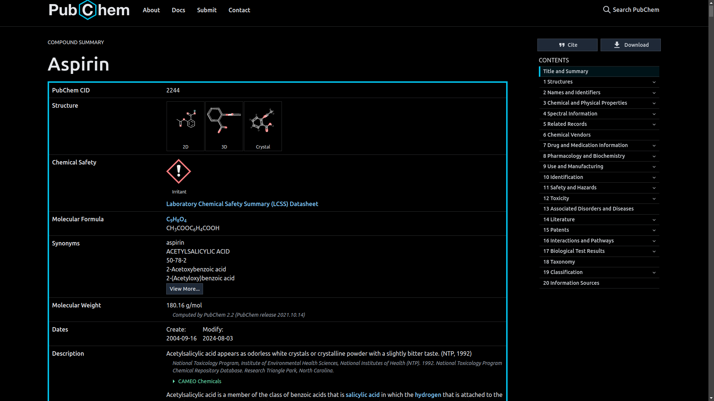
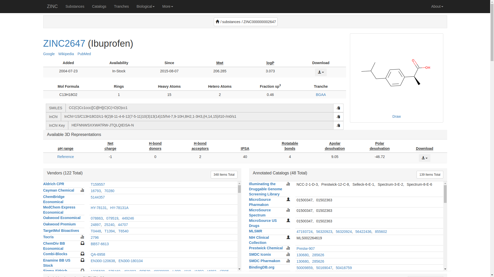

--- 
title: "R Course"
author: "YOUR NAME HERE"
date: "`r Sys.Date()`"
site: bookdown::bookdown_site
---
# Analysis of Drug like Molecule using ChemmineR

## Objectives
The objectives of this project is to;

- predict the physicochemical/structural properties, structural similarity searching, classification and clustering of drug like molecular library.
- to visualize the functions for compound clustering results and chemical structures. 

## Outcome
Learner will able to analyze the drug-like small molecule in R

## Informatics
Informatics refers to the study , design and application of computer and information systems to solve problems and improve processes in various domains. 
These are some of the aspects covered in informatics;

- Health informatics
- Bioinformatics 
- Data Informatics 
- Clinical informatics
- Cheminformatics 
- Social informatics 
- Business informatics

This course will focus exclusively on Bioinformatics and Chemoinformatics.

### Bioinformatics 
It is the information technology designed to generate and access biological data and derive information from it. 

### Chemoinformatics 
It is the information technology used to design molecular libraries that interact with the identified targets  
 
  
**NOTE:** 
Bioinformatics and chemoinformatics are generic terms that encompass the design, creation, organization, management, retrieval, analysis, identification, visualization and use of chemical and biological information.

In this course,it will be used to manage information such as;

- Chemical properties
- Chemical synthesis
- Biological effects 

According to Jurgen B, 2004 defines *Cheminformatics* as the focus ion the information resources needed to optimize of the properties of a ligand to become a drug. It is derived from `Chem-`, `chemi-` or `chemo-informatics`

*Chemical Informatics* is the application of information technology to chemistry(not with a specific focus on drug discovery). 

Frank Brown, 1998 defines Cheminformatics as the mixing of information resources to transform data into information and information into knowledge, for the intended purpose of making decisions faster in the arena of drug lead identification and optimization. 

### Application of Chemoinformatics in the Drug Industry
The computer is used to analyze the interactions between the drug and the receptor site and design molecules with an optimal fit. 

Once targets are developed are developed, libraries of compounds are screened for activity with one or more relevant assays using High Throughput Screening. 

**HITS (High Throughput Screening)**  
 
The Biochemical target is identified and many compounds are tested on it. The compound with desired effect on the target are selected by HITS. 

HITS is directly used as chemical probe to study the target and it provides the structure for chemists to begin developing a drug or other product. 

Hits are then evaluated for binding, potency, selectivity, and functional activity. 

The researchers then seek to improve the potency of the drug such as;

- Absorption 
- Distribution
- Metabolism
- Excretion
- Toxicity

The potential drug candidates should be in line with Lipinski's Rule of 5, according to Lipinski et al, 1997. These are;

- Have 5 or fewer H-bond(Hydrogen bond) donors (expressed as the sum of OHs and NHs)
- Have a MW less than 500
- LogP less than 5
- Have 10 or less H-bond acceptors (expressed as the sum of Ns and Os)
- Have a number of rotatable bond less than 10

#### Small Molecule
 A small molecule is a low molecular weight organic compound which is by definition not a polymer. In pharmacology, 'small molecule' is usually restricted to a molecule that also binds with high affinity to a biopolymer such as protein, nucleic acid, or polysaccharide and in addition alters the activity or function of biopolymer
 
### Chemical databases
There are many chemical databases, here are some of them;

- Drugbank
- Pubchem
- Zinc

#### The Drug Bank
The drug Bank database is a comprehensive freely accessible, online database containing information on drugs and drug targets created and maintained by the University of Alberta and The Metabolomics Innovation Centre located in Alberta, Canada in 2006. 

The homepage of this online database can be accessed anywhere by the link below 

https://www.drugbank.ca/

The homepage will show up as below

The information includes the drug chemical structures, mechanisms of action, interactions, and pharmacological data. In this course, we will analyze the Amoxicillin drug which is a small molecule using the Drug Bank. Follow the steps below; 

- Visit the Drug Bank homepage at https://www.drugbank.ca/. The homepage will show up. 
- Click at the search bar on top of the page and type `"Amoxicillin"` and enter to search. The search results for Amoxicillin will probably show up as t below

- Scroll down to the structure section to view its chemical structure. It will show up as 

Amoxicillin is a broad-spectrum antibiotic used to treat various bacterial infections. Its molecular formula is C16H19N3O5S with a molecular weight of 365.4 g/mol. Amoxicillin inhibits bacterial cell wall synthesis, leading to bacterial cell death. It is effective against a range of Gram-positive and Gram-negative bacteria.

Amoxicillin is well-absorbed orally and is stable in gastric acid. It is primarily excreted unchanged in the urine. Common side effects include gastrointestinal issues and skin rash, with severe allergic reactions being rare but possible. Amoxicillin can interact with drugs like methotrexate and oral contraceptives.

There is more information, this is just but a summary. For more information visit the [DrugBank entry for Amoxicillin](https://go.drugbank.com/drugs/DB01060)

#### The PubChem
PubChem is the world's largest collection of freely accessible chemical information. The chemicals are searched by their name, molecular formula, structure, and other identifiers. Find chemical and physical properties, biological activities, safety and toxicity information, patents, literature citations and more. 

This website is maintained by the National Center for Biotechnology Information (NCBI) and includes information on chemical compounds, substances and bioassays. 

Bioassay is a scientific method that measures the effect of a substance on living organisms, such as plants, cells, or tissues. 

In this course, we will use the PubChem website to analyze the Aspirin drug. For effective analysis, the following steps will be followed; 

- Visit the PubChem website at https://pubchem.ncbi.nlm.nih.gov/. The homepage below will show up. 

- Click the search bar at the center, type `"Aspirin"` then press "enter". There will be numerous entries from the search results as shown below

- The website provides the best matches but select the most preferred result that fits your reseacrh needs. In this case we will go with the best match, `Aspirin(CID 2244)`. 
- The PubChem website will provide the details of the Aspirin drug as;

.

Aspirin (acetylsalicylic acid) is a widely used medication for pain relief, fever reduction, and anti-inflammatory purposes. It has a molecular formula of C9H8O4 and a molecular weight of 180.16 g/mol. Aspirin works by inhibiting cyclooxygenase enzymes, reducing the production of prostaglandins and thromboxanes, which alleviates pain and inflammation.

Aspirin is rapidly absorbed from the gastrointestinal tract and widely distributed in body tissues. It is metabolized in the liver and excreted primarily through the kidneys. Common side effects include gastrointestinal irritation and increased risk of bleeding. Aspirin can interact with various drugs, including anticoagulants and other NSAIDs.

This is just but a summary from the PuChem entry for Aspirin, for more detailed information visit https://pubchem.ncbi.nlm.nih.gov/compound/2244

#### The ZINC Interface
It is a free database of commercially-available compounds for virtually screening and contains over 230 millions purchasable compounds in ready-to-dock, 3D formats. ZINC also contains over 750 million purchasable compounds. It is provided by Irwin and Shoichet Laboratories in the Department of Pharmaceutical Chemistry at the University of California San Francisco (UCSF). 

This is curated collected of commercially available chemical compounds prepared especially for virtual screening. 

The database contains over 37 million enumerated searchable, commercially available compounds in 2D, over 4.5 billion of which have been built in biologically relevant ready-to-dock 3D formats. The database can be searched online using whole-molecule similarity, substructure, and patterns in 2D

The guide below will demonstrate how to analyze the Ibuprofen drug using the ZINC interface step by step. Any other drug can be analyzed using the same technique. 

- Visit the ZINC database website at http://zinc.docking.org/ using web browser of your choice. The ZINC homepage will show as below. 

- Navigate tp the `"substances"` tab on top of the page. The page below ill appear. Click on the search bar on top-left corner of the page, type `"Ibuprofen"` and press enter to search. 

- More than one type of Ibuporofen will show up. In this case, we are interested on ZINC2647(Ibuprofen) which will probably appear on the top. Click it to show the details. 
- The details of Ibuprofen will display as; 

Here's an example summary of what you might find:

Ibuprofen is a nonsteroidal anti-inflammatory drug (NSAID) used for pain relief, fever reduction, and anti-inflammatory purposes. It has a molecular formula of C13H18O2 and a molecular weight of 206.28 g/mol. Ibuprofen inhibits cyclooxygenase enzymes (COX-1 and COX-2), leading to decreased production of prostaglandins and reducing inflammation and pain.

Ibuprofen is rapidly absorbed from the gastrointestinal tract and widely distributed throughout the body. It is metabolized in the liver and excreted primarily through the kidneys. Common side effects include gastrointestinal irritation and an increased risk of bleeding, especially with prolonged use.

For further information visit https://zinc.docking.org/substances/ZINC000000002647/

## Why ChemmineR tool 
`ChemmineR` is a chemoinformatics package for analyzing drug-like small molecule data in R . In addition, `ChemmineR    offers visualization functions for compounds clustering results and chemical structures. 

The integration of chemoinformatics tools with the R programming environment has many advantages, such as aeasy access to a wide spectrum of statistical methods, machine learning algorithms and graphic utilities. 

`ChemmineR` is an online service for analyzing and clustering small molecules by structural similarities, physicochemical properties or custom data types. 

<Check min 1hr 5mins>

### Overview of Chemmine web tool
<add the web interface> 

Chemmine WEb Tools is an online service for analyzing and clustering small molecules by structural similarities, physicochemical properties or custom data types. Compounds can be imported into the workbench by drawing structures in the web browser, copy and paste, from local files, or from a PubChem search which includes an online molecular editor. 

## Exploring drug like molecules databases

<check 1hr 9min> 

